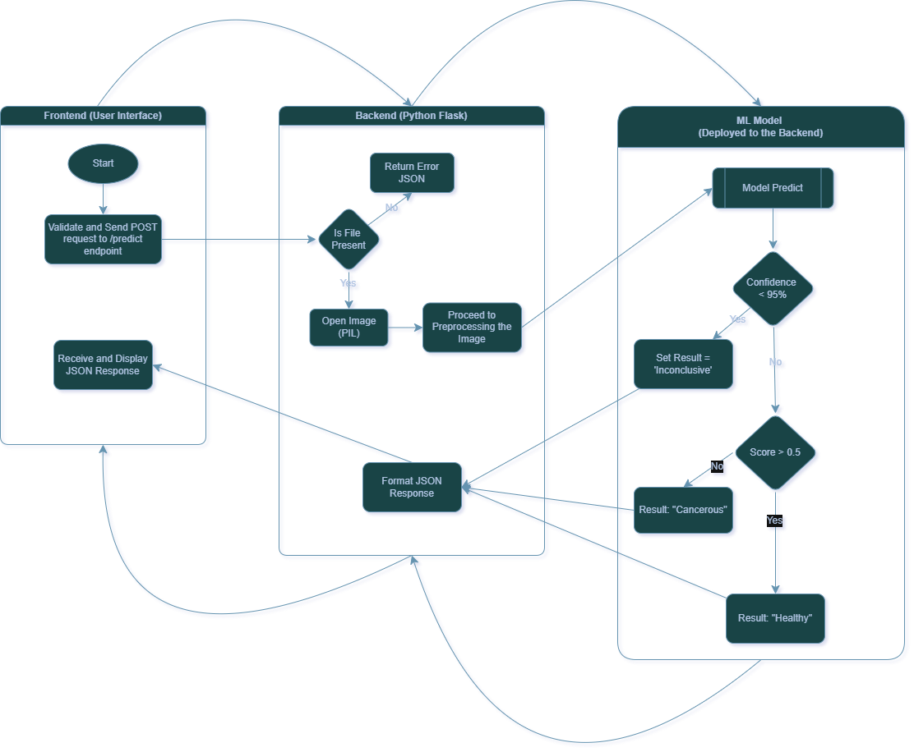

# 🩺 NeuroScan: AI-Powered Throat X-Ray Analysis


**NeuroScan** is a medical diagnostic microservice designed to assist in the early detection of throat cancer. It uses a Convolutional Neural Network (CNN) to analyze X-ray images and identify carcinogenic tissue patterns with high precision.

The application features a modern, responsive "Glassmorphism" UI and a robust Flask backend that acts as an inference API.

---

## ✨ Key Features

* **Real-Time AI Analysis:** Instant classification of "Healthy" vs. "Cancerous" tissue.
* **Confidence Thresholding:** Returns an "Inconclusive" result if the AI's confidence score drops below 70%, ensuring medical safety.
* **Microservice Architecture:** Clean separation of concerns with a modular package structure (`pkg`, `routes`, `utils`).
* **Responsive UI:** A drag-and-drop interface built with Vanilla JS and CSS3 that provides scanning animations and dynamic result visualization.

---

## 🛠️ Architecture

The project follows a scalable Flask application factory pattern:

```text
THROAT_AI/
│
├── app.py                # Application Entry Point (Sets Env Variables)
├── config.py             # Configuration (Paths & Settings)
│
└── pkg/                  # Main Package
    ├── __init__.py       # App Factory
    ├── routes.py         # API Endpoints (The "Traffic Controller")
    ├── utils.py          # AI Logic, Model Loading, & Image Processing
    ├── models/           # Stores the trained .h5 model
    │   └── model.h5
    └── templates/        # Frontend (HTML)
        └── index.html 
```
---

## 💻 Installation

Follow these steps to set up the project locally.

### 1. Clone the Repository
```bash
git clone [https://github.com/Kolad3/Oral_Cancer_Detector_FlaskAPP.git](https://github.com/Kolad3/Oral_Cancer_Detector_FlaskAPP.git)
cd Oral_Cancer_Detector_FlaskAPP
```

### 2. Create a Virtual Environment
Use a virtual environment to keep dependencies isolated.

Windows:
```bash
python -m venv venv
venv\Scripts\activate
```
macOS / Linux:
```bash
python3 -m venv venv
source venv/bin/activate
```

### 3. Install Dependencies
```bash
pip install -r requirements.txt
```

### 4. Setup the AI Model
* **Download:** Place your trained model file (e.g., model.h5) into the project folder.

* **Location:** Ensure it is saved at ``` pkg/models/model.h5.```

### 5. Run the Application
```bash
python app.py
```
The server will start at ``` http://127.0.0.1:5000/```

---

```markdown
## 🚀 How It Works


1. **Upload:** The user uploads a generic image file...